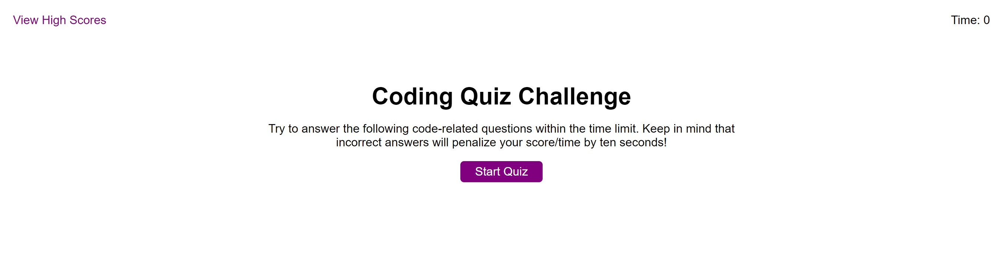

# Boot Camp - Module 4 Challenge - Web APIs Challenge: Code Quiz

## About

A JavaScript coding challenge for UConn Boot Camp.

## Description

This was a tough challenge for me. I put in a lot of hours researching different ways to approach a JavaScript quiz application, the set interval method in the HTML DOM API, how to use the HTML DOM API generally, as well as how to use the Web Storage (Local Storage) API. I had to write and rewrite my code quite a few times to get everything working. At one point, I had to comment out all my code and go back through it one step at a time because I was getting a lot of errors regarding my variables.

One of the main challenges I encountered was understanding how the Local Storage API works. I could not get any of it to function until I started studying some tutorials that went step-by-step through how to use the Local Storage API. Also, I was going to store the high scores on a second HTML page; however, I could not figure out how to get my JavaScript and the local storage to work between two different web pages. In the end, I stuck with one web page that has functionality to show and hide the high scores container.

I also spent a lot of time going over the code in the activities we were given in class during Module 4: Web APIs. The code regarding the HTML DOM API set timer method was very useful. I ended up studying it a lot, going through it step-by-step, and altering some of it (particularly the code from 09-Ins_Timers-Intervals and 10-Stu_Timers-Intervals) to work within my own code. I also studied and modified the code in the storage todos examples (25-Ins_Local-Storage-Todos and 26-Stu_Local-Storage-Todos).

**Note:** This project was tested in Google Chrome (Version 108.0.5359.125) only. Cookies must be enabled for this project to function. In Google Chrome, be sure to select: `Settings > Privacy and security > Cookies and other site data > General settings > Allow all cookies.`

## Technologies

HTML, CSS, JavaScript, HTML DOM API, Web Storage API, Git, GitHub, VS Code, Chrome

## Screenshot

## Deployment

[GitHub Pages](https://kkarrwrites.github.io/boot-camp-module-04-challenge-code-quiz/)

## License

This project is licensed under the MIT License.

## Resources

### HTML DOM API

- [JavaScript DOM Tutorial](https://www.youtube.com/playlist?list=PL4cUxeGkcC9gfoKa5la9dsdCNpuey2s-V) by The Net Ninja
- [setInterval()](https://developer.mozilla.org/en-US/docs/Web/API/setInterval) on MDN

### HTML Buttons

- [HTML Button Link Code Examples – How to Make HTML Hyperlinks Using the HREF Attribute on Tags](https://www.freecodecamp.org/news/html-button-link-code-examples-how-to-make-html-hyperlinks-using-the-href-attribute-on-tags/) by Jessica Wilkins on freeCodeCamp

### JavaScript Quiz Examples

- [Build A Quiz App With JavaScript](https://youtu.be/riDzcEQbX6k) by Web Dev Simplified
- [How to create a Simple JavaScript Quiz?](https://www.geeksforgeeks.org/how-to-create-a-simple-javascript-quiz/) on GeeksforGeeks

### Web Storage API

- [How to Use Local Storage with JavaScript](https://www.taniarascia.com/how-to-use-local-storage-with-javascript/) by Tania Rascia
- [How to Use Local Storage with JavaScript](https://www.section.io/engineering-education/how-to-use-localstorage-with-javascript/) by Michael Barasa
- [JavaScript LocalStorage: a Complete Guide](https://meticulous.ai/blog/localstorage-complete-guide/) by Subha Chanda on Meticulous
